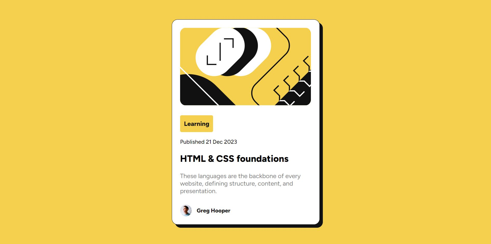

This is a solution to the [Blog preview card challenge on Frontend Mentor](https://www.frontendmentor.io/challenges/blog-preview-card-ckPaj01IcS). Frontend Mentor challenges help you improve your coding skills by building realistic projects. 

## Table of contents

- [Overview](#overview)
  - [The challenge](#the-challenge)
  - [Screenshot](#screenshot)
  - [Links](#links)
- [My process](#my-process)
  - [Built with](#built-with)
  - [What I learned](#what-i-learned)
  - [Continued development](#continued-development)
- [Author](#author)

## Overview

### The challenge

Users should be able to:

- See hover and focus states for all interactive elements on the page

### Screenshot



### Links

- Repository URL: [GitHub](https://github.com/moadavou/blog-preview-card)
- Live Site URL: [GitHub Pages](https://moadavou.github.io/blog-preview-card/)

## My process

### Built with

- Semantic HTML5 markup
- CSS custom properties
- Flexbox
- Mobile-first workflow

### What I learned

I learned how to use local font files and host the fonts myself instead of using a link to Google Fonts.

```css
@font-face {
    font-family: fontname;
    src: url(...);
}
```

### Continued development

I'm bad at estimating the time it takes for me to complete a project. I tend to do other things, lose focus, or have a difficult time beginning the project.

In the future, I want to improve my focus so I can complete the project closer to the estimated timeframe. 

## Author

- Frontend Mentor - [@moadavou](https://www.frontendmentor.io/profile/moadavou)
- GitHub - [@moadavou](https://github.com/moadavou)